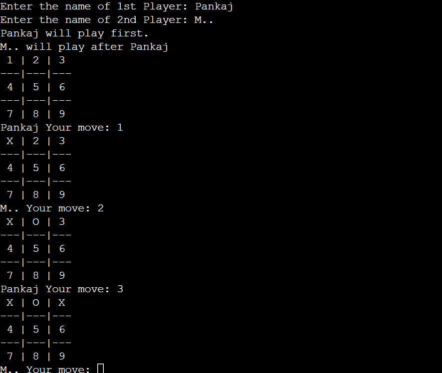

# Tic-Tac-Toe Game

A simple and entertaining command-line Tic-Tac-Toe game written in C++. Compete against a friend and relive the classic game of X and O.

  

## :video_game: How to Play

1. **Clone** or **download** this repository to your local machine.
2. **Compile** the source code using a C++ compiler.
3. **Run** the executable file to start the game.
4. **Enter** your names and follow the on-screen instructions.
5. **Take turns** to place your 'X' or 'O' on the 3x3 grid.
6. **Win** with three in a row, column, or diagonal, or it's a **tie**!

## :trophy: Features

- :game_die: Simple, yet addictive command-line interface.
- :couple: Two-player mode for interactive gameplay.
- :star2: Intelligent win-checking logic.
- :brain: Perfect for honing your strategic thinking.

## :open_file_folder: Project Structure

- `main.cpp`: The main C++ source code for the Tic-Tac-Toe game.
- `LICENSE`: The project's MIT License.
- `README.md`: The documentation file.

## :raised_hands: Contribution

Contributions and improvements are welcome! Whether it's fixing bugs or adding new features, feel free to open an issue or create a pull request.

## :scroll: License

This project is licensed under the [MIT License](LICENSE) - enjoy the game!

---

  
**Get ready to have fun!**

